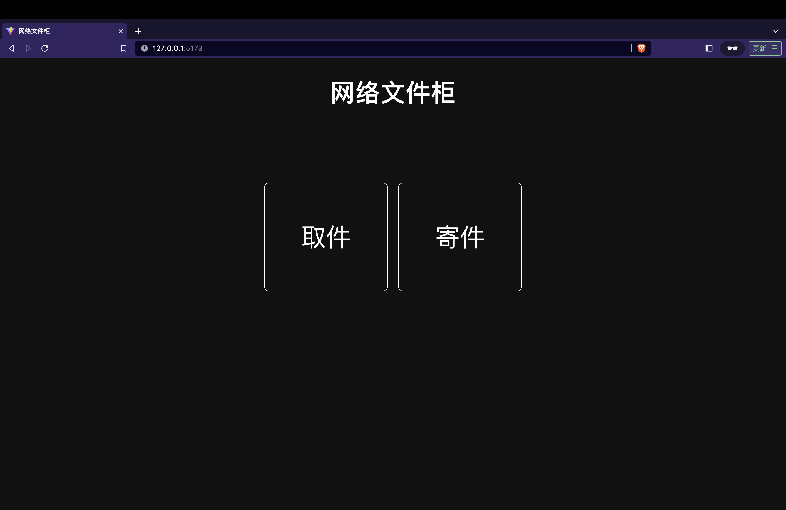
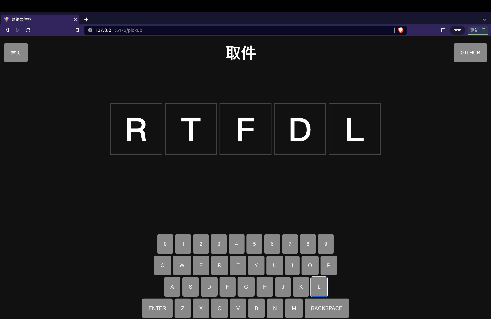

# Filebox

一个网络版丰巢智能柜, 想放什么东西给谁, 无需登录注册, 用完即走

首页

取件

## 为什么想做这个东西？

- 闹着玩
- 看到别人做了挺好玩的:)

## 类似用完即走的网站有哪些？

- 短连接网站
- 二维码生成网站
- 各类小工具网站

## 和云盘分享链接有何不同？

- 无需注册和登录
- 用完即走
- 阅后即焚

## 灵感来源？

- [FileCodeBox](https://github.com/vastsa/FileCodeBox) Python 代码写得是真简洁啊

## 用到的技术栈？

- 前端: React
- 后端: Rust + Postgres(为啥使用 Rust, 是有什么想不开? 尝试使用不同的语言开发同一件事, 很多人说语言不重要, 但语言的生态很重要, 你对一个语言的生态越熟悉, 相应的, 切换到另一种语言的生态的成本就越高, 开发过程中发现 Rust 由于有所有权的机制, 导致代码的写法和 Java, Go 非常不一样, 思考的方式也不一样)

## 最后想说点啥？

- 总是要做点无聊的事情:)
- 话说你们敲了那么久的代码, 有没有自己的作品, 我反正没有:(
